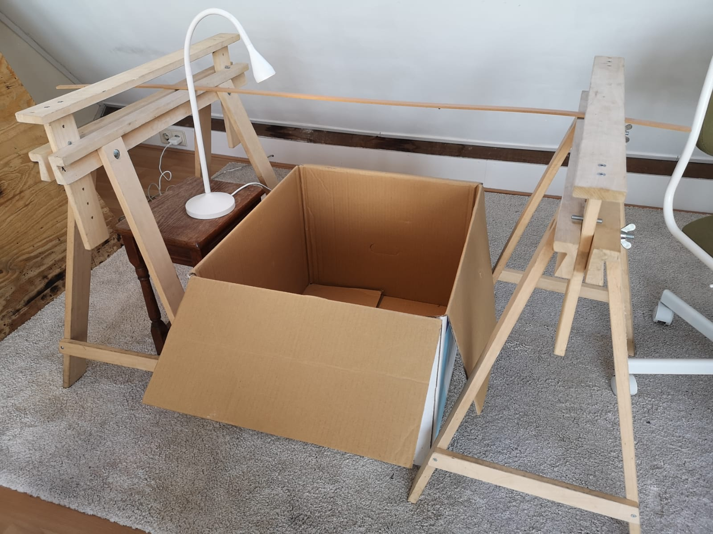
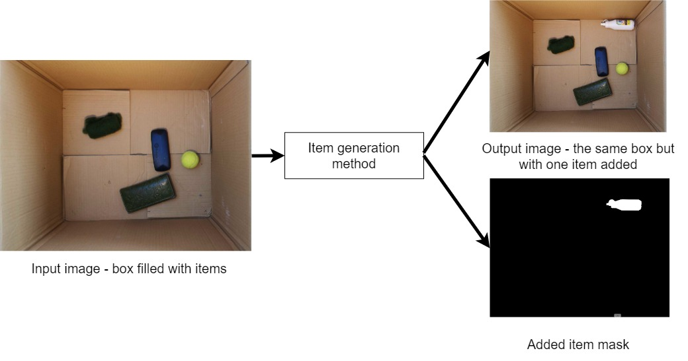
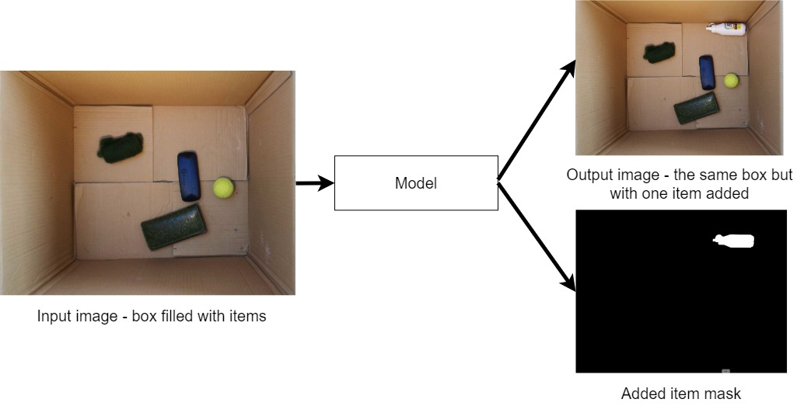
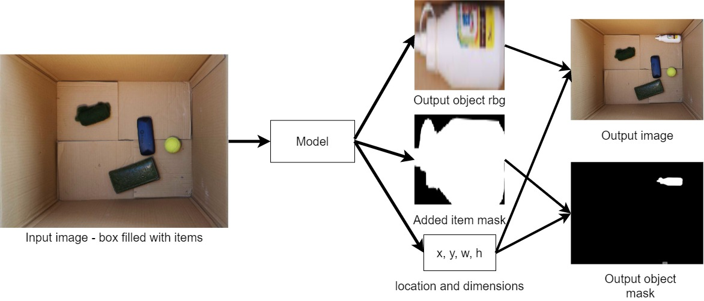

# computer-vision-group-35

# Deep-learning methods for dataset augmentation
**Authors:** Michał Grzejdziak (5266440), Sviatoslav Voloshyn (4774361)
***

## 1. Introduction
In 1965 businessman and computer scientist Gordon Moore observed that the number of transistors in a dense integrated 
circuit doubles approximately every two years, which means a doubling of computer processing power. Since the invention 
of a conventional computed, what is known by Moore's law has affected every sphere of human life. One area, where the 
effect has been exceptionally pronounced is deep learning. 

More powerful hardware allows researchers to study models with increasing complexities and generally achieve better 
results. In recent years, however, more and more claims are being made in support of more data over more complex models. 
For example, Musgrave et al. [[1]](#1) show that when discounting the differences in pre-processing, evaluation metrics 
and choice of hyperparameters, the true accuracy of deep metric learning models has been uniform between 2006 and 2020. 
Similar trends are apparent in the industry as well, with Google’s Research Director Peter Norvig claiming that: “Simple 
models and a lot of data trump more elaborate models based on fewer data.”

<figure>

<figcaption align = "center"><b>Fig. 1 - Claimed and true improvements in deep metric learning since the baseline paper 
on contrastive loss in 2006, Musgrave et al., (2020)</b></figcaption>
</figure>

With these trends in mind, we decided to focus on finding ways to augment existing datasets. More specifically, we 
consider the task of object segmentation in a setting similar to a robotic stacking facility where a camera looks 
straight from the above to a box filled with items to pick.

We start with a dataset consisting of objects in a box. Using a smartphone camera, we collected 250 images where a 
single object was placed in the box. The same object was used 10 times with different orientation and placement. 
Afterwards 400 images were collected of 10 boxes. These start with one image in a box and add one other object each time 
an image is taken. The images of the empty box were recorded too in both cases. The resulting 650 images with different 
object configurations and the corresponding 13 images of the empty boxes form the starting dataset. The distinction 
between single-object images and multi-object ones was maintained.

 
<b>Fig. 2 - data collection setup</b>

 
<b>Fig. 3 - Single- and multi-item examples</b>

The task we want to solve is framed as follows: given an image of a cardboard box with or without items, generate a new 
item in the image along with its binary mask. The top-view diagram for this task is:

 
<b>Fig. 4 - high-level diagram for our method</b>

We implemented two algorithms using the [pytorch-lightning](https://www.pytorchlightning.ai/) framework in pursuit of 
expanding the dataset. A generative adversarial network (GAN) and a variational autoencoder (VAE) were used. In what 
follows we present and discuss each model and the results. In section 2. we describe the two ways which were adopted to 
encode the task as inputs and outputs to the model In section 3. we introduce our implementation of each of the two 
models with respect to the specifics of the task at hand. In Section 4. and Section 5. we present the results 
respectively for VAE and GAN. Afterwards, Section 6. will present the results of the AMT-type of experiment and Section 
7. will conclude the README with the potential future directions.

## 2. Input-output encoding

A proper input-output encoding is a critical design choice for each computer vision architecture. We experimented with 
several ways of doing it, with two of which we were able to produce reasonable results with at least one of analyzed
architectures. We call these two encoding methods "global view encoding" and "local view encoding" respectively.

### 2.1 Global view encoding
With global view encoding, we train the model to generate the whole image with a new item and image-level item mask.
Example output is:

The advantages of this encoding method are its simplicity and the possibility for a model to modify all parts of the 
image that can be affected by adding a new item, e.g. shadows or item folding. The disadvantage is that the model has
to learn to generate large amount of pixels that are irrelevant for addition of a new item. It means that in order 
to achieve a good resolution of a generated item, the model has to compute-intensive because it has to generate the 
whole image in this resolution, not only the item.

### 2.2 Local view encoding

The local view encoding is designed to be less compute-intensive than the global view encoding. It uses the fact that
the most pixels of the image is irrelevant for adding a new item and it may be enough to generate only the pixels of
the item. This can be achieved by training the model to generate three outputs: "zoomed" object image, "zoomed" object 
mask, and object bounding box. These outputs are then combined with the input image to paste the generated object on it.
This is shown in the below diagram:

The advantage of this encoding is that it is more scalable and lets us vary generated object resolution independently of
the image resolution. The disadvantage is that it 

## 3. Algorithms

### 3.1 VAE algorithm

We implemented a simple fully connected VAE and ran it both with global and local encoding, only adjusting the loss 
function in each case. The base network consists of two parts with constant depth <i>d</i> and width <i>w</i>:
1. Encoder with <i>d</i> fully-connected layers with output dimensionality of <i>w</i> followed by ReLU activations. The
inputs to the encoder are flattened and concatenated. The outputs of the encoder are fed into two heads which are single 
fully-connected layers with output dimensionality of <i>w</i> - one predicting mean of a multivariate Gaussian and the 
other predicting variances in all dimensions assuming independence of dimensions. The output of variance head is passed 
through exponential activation to ensure that the variances are positive. 
2. Decoder with <i>d</i> fully-connected layers with output dimensionality of <i>w</i> followed by ReLU activations. The 
input to the decoder is noise of dimensionality <i>w</i> sampled from encoder outputs during training and from N(0, 1) 
during inference. The outputs of the decoder are fed to output heads one for each of the outputs as described in 
sections 2.1 and 2.2. Each of the heads consists of a single fully-connected layer with output dimensionality as 
specified for its output.

For each of the setup wee train VAE with AdamW optimizer with constant learning rate 1e-3, betas 0.9 and 0.999, and 
weight decay 1e-5 for 30 000 gradient steps with batch size 100. We preprocess inputs to the model by resizing them to 
64x64 and fix the output dimensionality of the decoder to be the same. After inference, we resize the outputs to fit the 
original size of the image. During training we augment images by applying random horizontal and vertical flip. The loss 
function is different for each of the encodings. For the global encoding, we add up 4 components: 1) binary cross 
entropy between global mask predictions and global mask targets, multiplied by 10. to account for differences in scale 
in relation to other components, 2) DKL loss between the distributions produced by the encoder and N(0,1), 3) mean 
squared error loss between the predicted global rgb with object and target global rgb with object, 4) mean squared loss 
between the predicted object rgb crop and target object rgb crop. For the local encoding, we again add up 4 components: 1) 
binary cross entropy between local mask predictions and local mask targets, 2) DKL loss between the distributions 
produced by the encoder and N(0,1), 3) mean squared error between local object rgb predictions and local object rgb 
targets, 4) smooth l1 error between box location predictions and box location targets. For both cases

For all experiments we fix <i>w</i>=512 and <i>d</i>=5. With this as a baseline, we also experiment with 1) adding 
BatchNorm after each hidden linear layer, 2) adding Dropout after each BatchNorm layer. We find that adding both 
BatchNorm and Dropout is beneficial to make model overfit less. Another experiment we perform is to concatenate an 
embedding of the input image to decoder inputs, but we find it makes the model overfit to training images and produce 
for test images either no meaningful objects or the exact same objects as for similar training images. We give more 
details of these experiments in section 4.

### 3.2 GAN algorithm

Two versions of GAN were attempted: convolutional and fully-connected. Based off the success of VAE, the fully-connected 
model was prioritized. The basis for the underlying generator and discriminator models was extracted from the original 
research paper introducing GAN by Ian Goodfellow [[2]](#2). 

Furthermore, different settings were implemented for both generator and discriminator. In the global version of the 
algorithm, the generator takes as input either rgb image of a box concatenated with noise or pure noise. It was 
hypothesised that for the use case at hand, the empty box should not serve as a statistical prior for image generation, 
since the box is always the same. When the generator takes in only noise, the raw image is added to the output. This can 
be done either by making use of the produced mask or simply adding the two vectors. For the global generator a global 
discriminator was implemented, which is identical to the one proposed in [[2]](#2).

Alternatively, the generator can be implemented similarly to the local version of the encoder for VAE. In this case, the 
job of the generator is to output zoomed object rgb, zoomed soft object mask and the soft object mask. Using the 
processing method described in Section 2, the output image is then generated. In this case, both a global discriminator 
and a local discriminator was attempted. The local discriminator differs in that it explicitly discriminates the two 
masks and the zoomed in rgb image by performing multi-head operations on the concatenated vector.

The loss function in all cases was the classical binary cross-entropy loss between the batch discriminator output and 
the ground truth vector. 

## 4. VAE results

### 4.1. Visualization

### 4.2. Ablation study

## 5. GAN results
Unlike VAE, GAN was not found effective at generating additional data. The difference between the current application 
and typical use cases for GAN is that the RGB image of the box must form the background of the generated image. This 
section will explain the failure causes of both a local and a global implementation of GAN.

### 5.1 Global GAN

Below is the output of the global GAN implementation, when trained on 30000 steps. One observation is that both the mask 
and the RGB image itself seem to average the train dataset distribution. Initially, we thought that it was attributed to 
the large dimensionality of the latent dimension. After the dimension was reduced, the output suffered from mode 
collapse, but was still very noisy itself. 

One explanation could be that the generator was simply unable to get strong enough with the size of the current dataset. 
Throught Kullback-Leibler loss, VAE explicitly forces the underlying distribution to be as close to the normal 
distribution with the mean of 0 and variance of 1 as possible. This way, semantic features such as uniformity of colour 
are encoded. GAN, on the other hand, is less constrained and thus requires more data to learn the underlying 
distribution.

<figure>

<figcaption align = "center"><b>Fig. 3 - Global GAN prediction</b></figcaption>
</figure>

### 5.2. Local GAN
The local GAN implementation did not produce promising results either. In this case, the key issue was most certainly 
the convergence to a local optima. The figures below show the generated image based on a model trained for some number 
of epochs. Almost immediately, the discriminator moves the bounding box away from the centre of the frame. With each 
iteration, the bounding box becomes smaller, after which it eventually converges to a single pixel in one of the four 
corners. 

<figure>

<figcaption align = "center"><b>Fig. 4 - Local GAN results</b></figcaption>
</figure>

This happens because at the beginning the bounding box is filled with randomly initialized RGB values. Because the 
ground truths never contain a perfectly straight gray rectangle, the discriminator has no trouble identifying the fake 
images. 

At this point, the expected behaviour is that the generator will learn to transform the random RGB values to something 
more resembling of a real object. However, because the generator outputs not only the zoomed in object, but also the 
bounding box for the object, the generator finds it easier to simply make the bounding box smaller to generate images 
look similar to an empty box.

Because the real objects typically take up only a small portion of the box, the discriminator can be easily fooled, 
especially during the early training cycles, by quering an empty box as a fake sample. 

After only a few training batches, the GAN converges to a point where the generator outputs empty boxes and the 
generator is learning to discriminate. Some time later, the discriminator learns to identify empty boxes as fake 
samples, but the generator can not easily change what it produces. This causes the generator loss to steadily increase, 
identifying a GAN failure. 

The reason that the generator can not easily adapt is because it outputs the bounding box and the zoomed-in image 
separately. Improving on the zoomed-in image while the bounding box is one pixel large will not make any difference to 
the resulting image. In the same way, making the zoomed-in image more realistic will not fool the discriminator directly 
if the bounding box or the image mask is unrealistic. Therefore, improvements in all three areas need to occur at the 
same time, which is extremely unlikely. The generator is thus stuck in a local minima, where any small change will make 
the loss even larger. 

## 6. Survey for VAE

## 7. Future directions
With this we conclude our implementation of the data augmentation tool. Based on the limitation of the current work, we 
propose a number of future research directions. 

First of all, the results of this implementation should be linked with the initial research question of augmenting 
existing datasets. Augmentation includes both a quantitative and a qualitative component, and the latter was not yet 
tested. A potential test given the type of dataset used could be to train a MaskRCNN model on generated data and compare 
the performance with an identical model trained exclusively on the 650 data samples we had collected. 

Another research direction is to improve the performance of the GAN implementation. One idea is to place a further 
constraint on the minimal size of the initial bounding box. If this fails, one could perform transfer learning to use 
the VAE decoder model as the starting point for GAN generator. This approach has a lot of potential as we have shown a 
number of conceptual similarities between GAN and VAE. 

Finally, the issues with a convolutional encoder and a convolutional decoder should be resolved.

## References
<a id="1">[1]</a> Musgrave, K., Belongie, S., &amp; Lim, S.-N. (2020). A metric learning reality check. Computer Vision – ECCV 2020, 681–699.  [https://doi.org/10.1007/978-3-030-58595-2_41]()

<a id="2">[2]</a> Goodfellow, I., Pouget-Abadie, J., Mirza, M., Xu, B., Warde-Farley, D., Ozair, S., Courville, A., &amp; Bengio, Y. (2020). Generative Adversarial Networks. Communications of the ACM, 63(11), 139–144. [https://doi.org/10.1145/3422622]()
